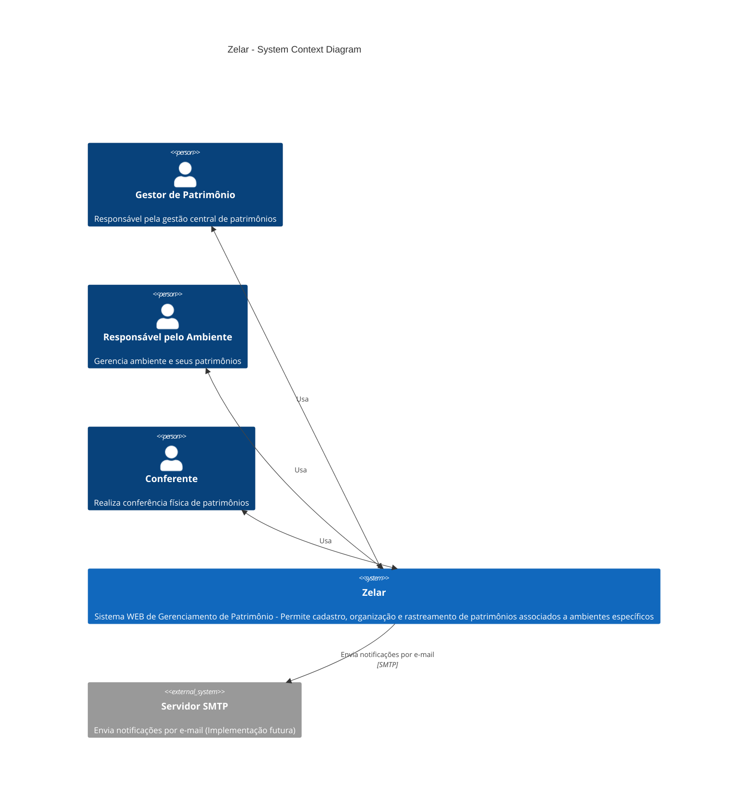
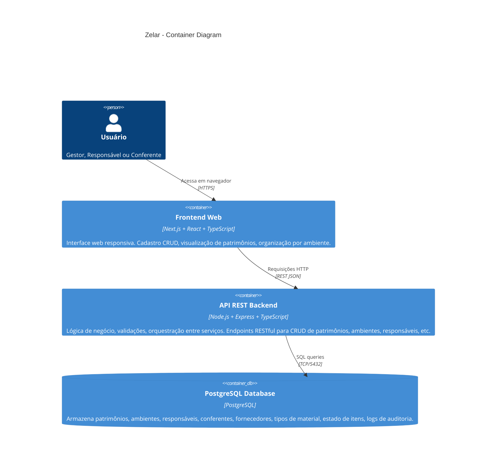

# Arquitetura do Sistema Zelar

## Visão Geral

O sistema Zelar é uma aplicação web monolítica com separação clara entre backend e frontend, projetada para gerenciar patrimônios em ambientes acadêmicos/corporativos. A arquitetura segue padrões MVC no backend e componentes modulares no frontend, com comunicação via API REST.

---

## Diagrama C4 - Visão de Contexto



---

## Diagrama C4 - Visão de Contêineres



---

## Diagrama C4 - Visão de Componentes (Backend)

```mermaid
C4Component
  title Zelar Backend - Component Diagram

  Container(api, "API REST") {
    Component(router, "Routes", "Express Router", "Define endpoints e mapeia requisições para controllers")
    Component(controller, "Controllers", "Express Middleware", "Recebe requisições, valida parâmetros, chama serviços e retorna respostas")
    Component(service, "Services", "Lógica de Negócio", "Implementa regras de negócio, validações e orquestração entre repositórios")
    Component(repo, "Repositories", "Data Access", "Acesso direto ao banco de dados via Sequelize ORM")
    Component(model, "Models", "Sequelize Models", "Define esquema de dados e relacionamentos")
  }

  Rel(router, controller, "Roteia para")
  Rel(controller, service, "Chama")
  Rel(service, repo, "Utiliza")
  Rel(repo, model, "Utiliza")
  
  UpdateLayoutConfig($c4ShapeInRow="2", $c4BoundaryInRow="1")
```

---

## Diagrama C4 - Visão de Componentes (Frontend)

```mermaid
C4Component
  title Zelar Frontend - Component Diagram

  Container(app, "Next.js App") {
    Component(pages, "Pages/Routes", "Next.js Pages", "Estrutura de rotas e layouts da aplicação (ambientes, patrimônios, responsáveis, etc)")
    Component(components, "Componentes React", "React Components", "Componentes reutilizáveis (Forms, Tables, Modals, Cards)")
    Component(lib, "Utilitários", "API Client & Helpers", "Funções auxiliares para consumir a API REST")
    Component(styles, "Estilos", "TailwindCSS", "Sistema de design responsivo")
  }

  Rel(pages, components, "Compõe")
  Rel(components, lib, "Utiliza")
  Rel(components, styles, "Estiliza com")
  
  UpdateLayoutConfig($c4ShapeInRow="2", $c4BoundaryInRow="1")
```

---

## Estrutura de Pastas

### Backend (`src/backend/src`)

```
src/
├── controllers/        # Manipuladores de requisições HTTP
│   ├── AmbienteController.ts
│   ├── PatrimonioController.ts
│   ├── ResponsavelController.ts
│   └── ...
├── services/           # Lógica de negócio
│   ├── AmbienteService.ts
│   ├── PatrimonioService.ts
│   └── ...
├── repositories/       # Acesso a dados
│   ├── AmbienteRepository.ts
│   ├── PatrimonioRepository.ts
│   └── ...
├── models/            # Definição de esquemas (Sequelize)
│   ├── Ambiente.ts
│   ├── Patrimonio.ts
│   ├── Responsavel.ts
│   └── ...
├── database/
│   ├── connection.ts   # Conexão Sequelize
│   ├── migrate.ts      # Script de migração
│   └── index.ts
├── config/
│   └── database.ts     # Configuração do banco
├── routes/            # Definição de rotas
└── app.ts             # Aplicação Express

```

### Frontend (`src/front/app`)

```
app/
├── ambientes/         # Módulo de Ambientes
│   ├── page.tsx       # Listagem de ambientes
│   └── [id]/
│       └── page.tsx   # Edição de ambiente
├── patrimonios/       # Módulo de Patrimônios
├── responsaveis/      # Módulo de Responsáveis
├── conferentes/       # Módulo de Conferentes
├── fornecedores/      # Módulo de Fornecedores
├── tipos-material/    # Módulo de Tipos de Material
├── estados-item/      # Módulo de Estados do Item
├── components/        # Componentes reutilizáveis
├── lib/              # Utilitários e API client
└── layout.tsx        # Layout principal
```

---

## Fluxo de Dados Principal

### Exemplo: Cadastro de Ambiente

```
1. Usuário preenche formulário no Frontend (AmbienteForm.tsx)
   ↓
2. Frontend valida dados e faz POST para /api/ambientes
   ↓
3. Express Router mapeia para AmbienteController.create()
   ↓
4. Controller valida nome e responsavel_id obrigatórios
   ↓
5. Controller chama AmbienteService.create()
   ↓
6. Service implementa regra de negócio (ex: validar responsável existe)
   ↓
7. Service chama AmbienteRepository.create()
   ↓
8. Repository usa Sequelize para executar INSERT no PostgreSQL
   ↓
9. Dados salvos no banco, retornam ao Repository
   ↓
10. Repository retorna dados ao Service
    ↓
11. Service retorna dados ao Controller
    ↓
12. Controller retorna JSON com status 201 ao Frontend
    ↓
13. Frontend recebe resposta e navega para listagem
```

---

## Componentes Principais e Responsabilidades

### Backend

| Componente | Responsabilidade | Exemplo |
|---|---|---|
| **Controller** | Recebe HTTP, valida e direciona | `AmbienteController.create()`: valida `nome` e `responsavel_id` obrigatórios |
| **Service** | Regras de negócio e orquestração | `AmbienteService.create()`: verifica se responsável existe antes de salvar |
| **Repository** | Acesso a dados via ORM | `AmbienteRepository.create()`: executa `INSERT` via Sequelize |
| **Model** | Definição de schema e relacionamentos | `Ambiente`: define colunas, tipos e validações |

### Frontend

| Componente | Responsabilidade | Exemplo |
|---|---|---|
| **Page** | Rota e layout da página | `/app/ambientes/page.tsx`: lista ambientes com tabela |
| **Form Component** | Formulário com validações locais | `AmbienteForm.tsx`: valida `nome` e `responsavel_id` antes de enviar |
| **API Client** | Comunicação com backend | `fetch('/api/ambientes')` em `lib/api.ts` |
| **Estilos** | Design responsivo | TailwindCSS classes em componentes |

---

## Dependências Externas

### Backend
- **Express**: Framework web
- **Sequelize**: ORM para PostgreSQL
- **Jest**: Framework de testes
- **TypeScript**: Tipagem estática

### Frontend
- **Next.js**: Framework React
- **React**: Biblioteca de UI
- **TypeScript**: Tipagem estática
- **TailwindCSS**: Framework de estilos

### Infraestrutura
- **PostgreSQL**: Banco de dados
- **Docker**: Containerização
- **Render**: Hospedagem (produção)

---

## Decisões Arquiteturais (ADRs)

Veja documentos detalhados em [`docs/adrs/`](./adrs/):
- [ADR-0001: Stack Principal](./adrs/ADR-0001-stack-principal.md)
- [ADR-0002: Arquitetura Padrão](./adrs/ADR-0002-arquitetura-padrao.md)

---

## Fluxos de Negócio

### Fluxo: Cadastro e Organização de Patrimônio

1. **Gestor** cadastra um novo **Patrimônio** (número, descrição, valor)
2. Sistema associa patrimônio a um **Tipo de Material**
3. Gestor associa patrimônio a um **Ambiente** (ex: Sala 10)
4. Sistema automaticamente associa patrimônio ao **Responsável** do ambiente
5. Patrimônio é armazenado no banco com estado "Em condições"

### Fluxo: Conferência e Relatório de Problemas

1. **Conferente** realiza conferência física dos patrimônios em um ambiente
2. Se item está com problema, **Conferente** altera estado para "Em manutenção" ou "Inservível"
3. Sistema registra a mudança em **Audit Log** com timestamp e usuário
4. **(Futuro)** Sistema envia notificação por e-mail ao **Responsável** e **Gestor**

---

## Relacionamentos Entre Entidades

```
┌─────────────────────────────────────────────────────────────┐
│                        PATRIMONIO                            │
├─────────────────────────────────────────────────────────────┤
│  id (PK)                                                     │
│  numero_patrimonio (UK)                                      │
│  descricao                                                   │
│  valor                                                       │
│  estado_item_id (FK) ──→ ESTADO_ITEM                        │
│  tipo_material_id (FK) ──→ TIPO_MATERIAL                    │
│  ambiente_id (FK) ──→ AMBIENTE                              │
│  responsavel_id (FK) ──→ RESPONSAVEL                        │
│  fornecedor_id (FK) ──→ FORNECEDOR (opcional)               │
└─────────────────────────────────────────────────────────────┘

┌──────────────────────────────────────────┐
│            AMBIENTE                      │
├──────────────────────────────────────────┤
│  id (PK)                                 │
│  nome                                    │
│  bloco (opcional)                        │
│  andar (opcional)                        │
│  responsavel_id (FK) ──→ RESPONSAVEL     │
└──────────────────────────────────────────┘

┌──────────────────────────────────────────┐
│          RESPONSAVEL                     │
├──────────────────────────────────────────┤
│  id (PK)                                 │
│  nome                                    │
│  email                                   │
│  cargo (opcional)                        │
│  departamento (opcional)                 │
│  telefone (opcional)                     │
└──────────────────────────────────────────┘
```

Para diagrama ER completo, veja [`docs/db/relacionamentos.md`](./db/relacionamentos.md).

---

## Segurança e Validações

### Backend
- Validação de dados obrigatórios em **Controller** (primeira camada)
- Validação de regra de negócio em **Service** (ex: responsável existe?)
- Constraints **NOT NULL** no banco de dados (última camada)
- Tratamento de erros com status HTTP apropriados

### Frontend
- Validação local em formulários (UX rápida)
- Campos `required` em inputs HTML5
- Asterisco (*) para campos obrigatórios
- Mensagens de erro claras ao usuário

### Auditoria
- Todos os dados incluem `created_at`, `updated_at` e `deleted_at` (soft deletes)
- Tabela `audit_log` rastreia alterações (implementação futura)

---

## Como Estender a Arquitetura

### Adicionar um Novo Módulo (ex: Sistema de Vendas)

1. **Criar Model** (`src/backend/src/models/Venda.ts`)
   - Definir schema com Sequelize

2. **Criar Repository** (`src/backend/src/repositories/VendaRepository.ts`)
   - Implementar CRUD

3. **Criar Service** (`src/backend/src/services/VendaService.ts`)
   - Adicionar regras de negócio

4. **Criar Controller** (`src/backend/src/controllers/VendaController.ts`)
   - Mapear requisições HTTP

5. **Criar Routes** (`src/backend/src/routes/venda.routes.ts`)
   - Adicionar endpoints

6. **Registrar Routes** em `src/backend/src/app.ts`
   - Importar e usar router

7. **Frontend**: Criar módulo em `src/front/app/vendas/`
   - Pages, componentes, formulários

---

## Métricas e Monitoramento

- **Métricas**: Ver [`docs/metricas.md`](./metricas.md)
- **Qualidade**: Ver [`docs/qualidade.md`](./qualidade.md)
- **Riscos**: Ver [`docs/riscos.md`](./riscos.md)
