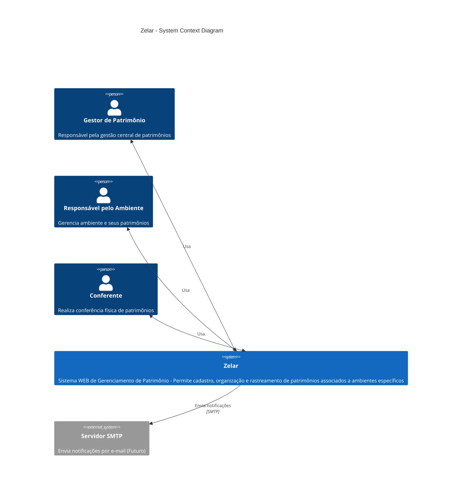
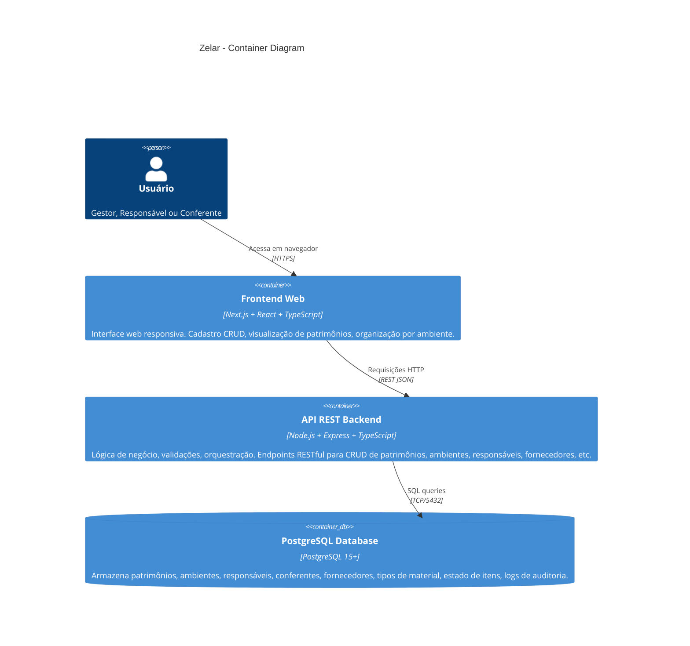

# Diagramas C4 - Zelar

Esta é uma referência rápida dos diagramas C4 do sistema Zelar. Para contexto completo e explicações, veja [`docs/arquitetura.md`](./arquitetura.md).

---

## C4 - Visão de Contexto



---

## C4 - Visão de Contêineres



---

## C4 - Componentes Backend

```mermaid
C4Component
  title Zelar Backend - Component Diagram

  Container(api, "API REST") {
    Component(router, "Routes", "Express Router", "Define endpoints e mapeia requisições para controllers")
    Component(controller, "Controllers", "Express Middleware", "Recebe requisições, valida parâmetros, chama serviços e retorna respostas")
    Component(service, "Services", "Lógica de Negócio", "Implementa regras de negócio, validações e orquestração entre repositórios")
    Component(repo, "Repositories", "Data Access", "Acesso direto ao banco de dados via Sequelize ORM")
    Component(model, "Models", "Sequelize Models", "Define esquema de dados e relacionamentos")
  }

  Rel(router, controller, "Roteia para")
  Rel(controller, service, "Chama")
  Rel(service, repo, "Utiliza")
  Rel(repo, model, "Utiliza")
  
  UpdateLayoutConfig($c4ShapeInRow="2", $c4BoundaryInRow="1")
```

---

## C4 - Componentes Frontend

```mermaid
C4Component
  title Zelar Frontend - Component Diagram

  Container(app, "Next.js App") {
    Component(pages, "Pages/Routes", "Next.js Pages", "Estrutura de rotas e layouts (ambientes, patrimônios, responsáveis, etc)")
    Component(components, "Componentes React", "React Components", "Componentes reutilizáveis (Forms, Tables, Modals, Cards)")
    Component(lib, "Utilitários", "API Client & Helpers", "Funções auxiliares para consumir a API REST")
    Component(styles, "Estilos", "TailwindCSS", "Sistema de design responsivo")
  }

  Rel(pages, components, "Compõe")
  Rel(components, lib, "Utiliza")
  Rel(components, styles, "Estiliza com")
  
  UpdateLayoutConfig($c4ShapeInRow="2", $c4BoundaryInRow="1")
```

---

## Referência Rápida de Componentes

### Backend - Camadas

| Camada | Arquivo | Responsabilidade |
|---|---|---|
| Routes | `src/routes/*.routes.ts` | Define endpoints HTTP e mapeia para controllers |
| Controllers | `src/controllers/*.ts` | Recebe requisições, valida e chama services |
| Services | `src/services/*.ts` | Implementa regras de negócio e orquestração |
| Repositories | `src/repositories/*.ts` | Acesso a dados com ORM (Sequelize) |
| Models | `src/models/*.ts` | Define schema, tipos e validações |

### Frontend - Estrutura

| Tipo | Caminho | Responsabilidade |
|---|---|---|
| Pages | `app/*/page.tsx` | Rotas e layouts por módulo |
| Components | `app/components/` | Componentes reutilizáveis |
| Utils | `app/lib/` | Helpers, API client, constantes |
| Estilos | `app/globals.css` | Estilos globais (TailwindCSS) |

---

## Fluxos de Dados Principais

### Fluxo 1: Cadastro de Ambiente

```
Frontend: AmbienteForm.tsx
  ↓ POST /api/ambientes { nome, responsavel_id }
Backend: Routes → AmbienteController → AmbienteService → AmbienteRepository
  ↓ INSERT INTO ambiente ...
Database: PostgreSQL
  ↓ 201 Created
Frontend: Navega para /ambientes
```

### Fluxo 2: Listagem de Patrimônios

```
Frontend: page.tsx
  ↓ GET /api/patrimonios
Backend: Routes → PatrimonioController → PatrimonioService → PatrimonioRepository
  ↓ SELECT * FROM patrimonio ...
Database: PostgreSQL
  ↓ 200 OK [ patrimonio[] ]
Frontend: Renderiza tabela
```

---

Para mais detalhes, consulte [`docs/arquitetura.md`](./arquitetura.md).
