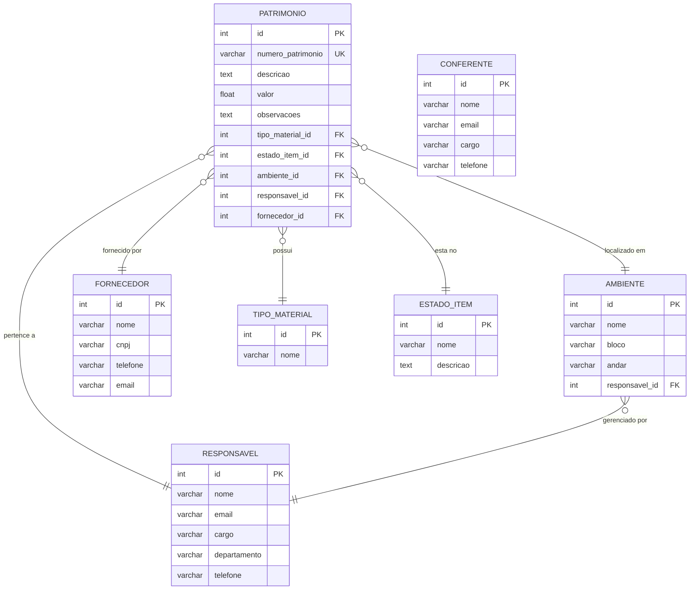

# Modelagem do Banco de Dados — Zelar

## Diagrama ER

O diagrama também está disponível no arquivo [`diagrama-er.mermaid`](./diagrama-er.mermaid).

## Entidades

### Tabelas auxiliares

| Tabela | Descrição | Campos obrigatórios |
|---|---|---|
| `tipo_material` | Classificação do bem (ex: mobília, infomrática) | `nome` |
| `estado_item` | Estado conservação do bem | `nome` |
| `fornecedor` | Empresa que forneceu o bem | `nome` |

### Tabelas de pessoas

| Tabela | Descrição | Campos obrigatórios |
|---|---|---|
| `responsavel` | Responsável por um patrimônio ou ambiente | `nome`, `email` |
| `conferente` | Realiza a conferência física do patrimônio | `nome`, `email` |

### Tabelas principais

| Tabela | Descrição | Campos obrigatórios |
|---|---|---|
| `ambiente` | Local físico que está o patrimonio (salas) | `nome`, `responsavel_id` |
| `patrimonio` | Bem patrimonial | `numero_patrimonio`, `descricao`, `valor`, `tipo_material_id`, `estado_item_id`, `ambiente_id`, `responsavel_id` |

---

## Relacionamentos

| Relação | Cardinalidade | Descrição |
|---|---|---|
| Patrimônio → Tipo de Material | N:1 | Cada patrimônio tem um tipo; um tipo pode ter muitos patrimônios |
| Patrimônio → Estado do Item | N:1 | Cada patrimônio tem um estado; um estado pode ter muitos patrimônios |
| Patrimônio → Ambiente | N:1 | Cada patrimônio está em um ambiente; um ambiente tem muitos patrimônios |
| Patrimônio → Responsável | N:1 | Cada patrimônio pertence a um responsável; um responsável pode ter muitos patrimônios |
| Patrimônio → Fornecedor | N:1 | Cada patrimônio tem um fornecedor (opcional); um fornecedor pode ter muitos patrimônios |
| Ambiente → Responsável | N:1 | Cada ambiente é gerenciado por um responsável; um responsável pode gerenciar vários ambientes |
